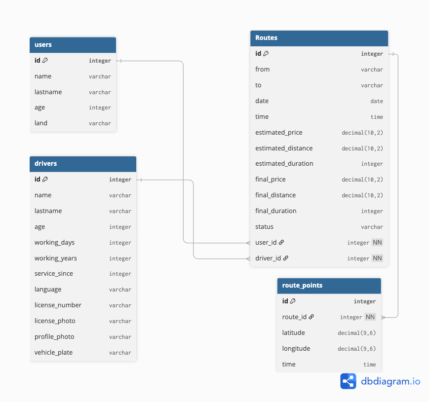
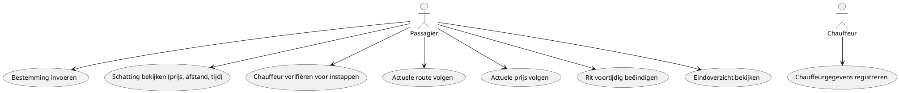
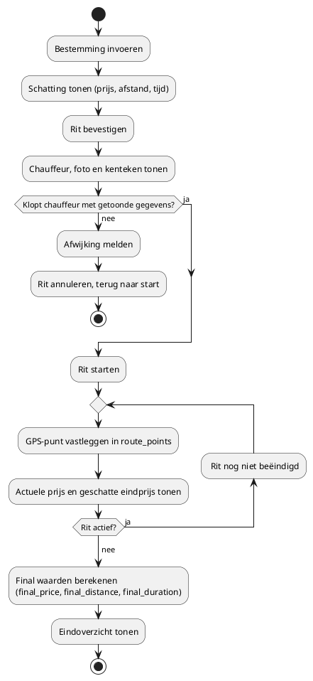
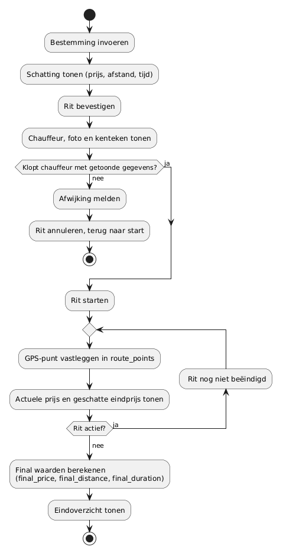

# HitchTracker — Ontwerp (Fase 1)

> Hackathon 3 — B1-K1-W2 (Ontwerpt software)
> Status: in uitvoering

## 1. Probleemomschrijving

Toeristen kunnen in onbekende steden niet goed beoordelen of een taxichauffeur
een eerlijke route en prijs rekent. HitchTracker maakt elke rit transparant:
vooraf een schatting (route, afstand, tijd, prijs), tijdens de rit het actuele
verloop, en na afloop een vastgelegd overzicht waarmee de passagier kan
aantonen wat er echt is gereden en gerekend. De chauffeur wordt vooraf
geverifieerd (document + foto), zodat de passagier weet dat hij bij de juiste
persoon instapt.

## 2. Gegevenslaag — ERD

Tool: dbdiagram.io (DBML)

```dbml
Table users{
  id integer [pk]
  name varchar
  lastname varchar
  age integer
  land varchar
}

Table drivers{
  id integer [pk]
  name varchar
  lastname varchar
  age integer
  working_days integer
  working_years integer
  service_since integer
  language varchar
  license_number varchar
  license_photo varchar
  profile_photo varchar
  vehicle_plate varchar
}

Table Routes{
  id integer [pk]
  from varchar
  to varchar
  date date
  time time
  estimated_price decimal(10, 2)
  estimated_distance decimal(10,2)
  estimated_duration integer
  final_price decimal(10, 2)
  final_distance decimal(10,2)
  final_duration integer
  status varchar [note: 'waiting, active, completed, cancelled, ended_early']
  user_id integer [ref: > users.id, not null]
  driver_id integer [ref: > drivers.id, not null]
}

Table route_points {
  id integer [pk]
  route_id integer [ref: > Routes.id, not null]
  latitude decimal(9,6)
  longitude decimal(9,6)
  time time
}
```


[Bekijk ERD op dbdiagram.io](https://dbdiagram.io/d/Hitchtracker-6aba51070f25a52d01296630)

**Ontwerpkeuzes:**

- `route_points` is een losse tabel: een rit bestaat uit veel GPS-punten en die passen niet in één kolom.
- `estimated_*` en `final_*` staan naast elkaar: alleen als je vooraf én achteraf iets vastlegt, kun je het verschil
  aantonen ("zwart op wit").
- `final_*` worden apart opgeslagen in plaats van steeds herberekend (zie 5.1).
- `decimal(10,2)` voor prijs en afstand: decimal rekent exact, een kommagetal (float) kan afrondingsfouten geven en bij
  geld mag er geen cent afwijken.
- `decimal(9,6)` voor coördinaten: 6 decimalen is ongeveer 10 centimeter nauwkeurig, ruim genoeg voor GPS.
- Duur is een `integer` in minuten: makkelijk te berekenen en te vergelijken met de schatting.
- `not null` op `user_id`, `driver_id` en `route_id`: een rit zonder passagier of chauffeur, of een punt zonder rit,
  heeft geen bewijswaarde.
- Foto's staan als `varchar` (pad of URL): bestanden horen niet in de database, alleen de verwijzing.
- `license_number`, `license_photo`, `profile_photo` en `vehicle_plate` in `drivers`: voor de verificatie vóór de rit,
  het enige moment waarop de passagier nog kan weglopen.
- `status` in `Routes`: geannuleerde (UC4) en voortijdig beëindigde ritten (UC7) moeten terug te vinden zijn.

## 3. Gebruikersperspectief

### 3.1 Use case diagram



UC3 hoort bij het ontwerp, maar valt buiten de scope van het prototype (zie `scope.md`). Chauffeurgegevens komen als
dummydata in de database.


### 3.2 Use case beschrijvingen

**UC3: Chauffeurgegevens registreren**

- **Actor:** Chauffeur
- **Trigger:** Chauffeur meldt zich aan als chauffeur in het systeem
- **Precondities:** Chauffeur heeft nog geen account
- **Hoofdflow:**
    1. Chauffeur vult persoonsgegevens in (naam, leeftijd, taal, etc.)
    2. Chauffeur uploadt rijbewijs-/vergunningsnummer en foto van het document
    3. Chauffeur uploadt een profielfoto van zichzelf
    4. Systeem slaat de gegevens op in `drivers`
- **Alternatieve flow:** Als het document onleesbaar of ongeldig is, wordt de registratie geweigerd en moet de chauffeur
  opnieuw uploaden
- **Postconditie:** Chauffeur staat geregistreerd, inclusief verificatiegegevens

**UC4: Chauffeur verifiëren voor instappen**

- **Actor:** Passagier
- **Trigger:** Taxi stopt bij de passagier, passagier opent de verificatie in de app
- **Precondities:** Rit is nog niet gestart; chauffeur is aan deze rit gekoppeld
- **Hoofdflow:**
    1. App toont profielfoto, naam en kenteken van de gekoppelde chauffeur
    2. Passagier vergelijkt dit met de persoon en de auto voor hem
    3. Passagier kiest "Dit klopt, start rit"
    4. Rit start (status `active`)
- **Alternatieve flow:** Klopt de persoon of het kenteken niet, dan kiest de passagier "Dit klopt niet". De rit wordt
  geannuleerd (status `cancelled`), de melding wordt door het bedrijf beoordeeld (zie 5.2) en de passagier gaat terug
  naar scherm 01.
- **Postconditie:** Rit is gestart, of geannuleerd

**UC7: Rit voortijdig beëindigen**

- **Actor:** Passagier
- **Trigger:** Passagier voelt zich onveilig of ziet dat route/prijs afwijkt
- **Precondities:** Rit is actief
- **Hoofdflow:**
    1. Passagier drukt op "rit beëindigen" in de app
    2. Systeem stopt het vastleggen van `route_points` voor deze rit
    3. Systeem berekent `final_price`, `final_distance`, `final_duration` op basis van de punten tot dat moment
    4. Systeem toont het (voortijdige) eindoverzicht
- **Postconditie:** Rit staat als voortijdig beëindigd geregistreerd, met final-waarden tot het moment van stoppen

**Overige use cases (kort):**

| Use case | Actor     | Omschrijving                                                                  |
|----------|-----------|-------------------------------------------------------------------------------|
| UC1      | Passagier | Voert bestemming in; bij ongeldig adres toont systeem foutmelding             |
| UC2      | Passagier | Bekijkt schatting van prijs, afstand en tijd op basis van UC1                 |
| UC5      | Passagier | Ziet live de gereden en nog te rijden route tijdens de rit                    |
| UC6      | Passagier | Ziet live de actuele prijs en de geschatte eindprijs tijdens de rit           |
| UC8      | Passagier | Bekijkt eindoverzicht (final_price, final_distance, final_duration) na afloop |

### 3.3 Wireframes / mock-ups

Low-fidelity wireframes, responsieve webapp (desktop 1280px), 5 schermen voor de
volledige ritflow van de passagier.

[Bekijk wireframes (pdf)](docs/hitchTracker_wireframes.pdf)

| #  | Scherm                             | Gekoppelde UC('s) |
|----|------------------------------------|-------------------|
| 01 | Bestemming invoeren                | UC1               |
| 02 | Schatting bevestigen               | UC2               |
| 03 | Chauffeur verifiëren (wachtscherm) | UC4               |
| 04 | Tijdens de rit                     | UC5, UC6, UC7     |
| 05 | Eindoverzicht                      | UC8               |

**Opmerkingen bij het ontwerp:**

- Scherm 01: "Volgende" blijft inactief tot beide adresvelden gevuld zijn; een
  ongeldig/onbekend adres toont een foutmelding onder het veld.
- Scherm 03: bij "Dit klopt niet" wordt de rit geannuleerd en gaat de passagier terug naar scherm 01. Dit is dezelfde
  alternatieve flow als in UC4 en in het activiteitendiagram.
- Scherm 04: toont de actuele prijs naast de geschatte eindprijs (`estimated_price`). Kaart en prijs worden bijgewerkt
  op basis van `route_points` (in dit prototype gesimuleerd). "Rit beëindigen" kan op elk moment en leidt direct naar
  scherm 05 (UC7).
- Scherm 05: toont `final_price`/`final_distance`/`final_duration` naast de
  `estimated_*`-waarden uit scherm 02, ter onderbouwing van het
  "zwart-op-wit"-uitgangspunt. Bij voortijdig beëindigen komt er een label
  "Rit voortijdig beëindigd" boven de titel.

## 4. Programmalogica

### 4.1 Activiteitendiagram





## 5. Onderbouwing

### 5.1 Haalbaarheid

`final_price`, `final_distance` en `final_duration` worden berekend uit de punten
in `route_points` (eerste en laatste `time`, en de afgelegde afstand/coördinaten
tussen de punten), maar worden na die berekening apart opgeslagen in `Routes`
in plaats van telkens opnieuw berekend te worden. Reden: zodra er veel ritten
zijn, zou je bij elke opvraging (bijv. klantenservice-overzicht van een hele
maand) door alle route_points van elke rit moeten lopen om de tijd/afstand/prijs
opnieuw te berekenen, dat is trager dan het resultaat één keer te berekenen
en klaar te zetten in `Routes`. De brondata (route_points) blijft bewaard als
bewijs, de final-kolommen zijn het al-berekende antwoord daarop.

Het prototype is een website (Next.js met TypeScript) met dummydata en gesimuleerde GPS-punten. Reden: de bouwtijd is
beperkt, en echte live GPS van een telefoon of een native app kost daar te veel van. Browser-GPS werkt alleen via HTTPS
en met toestemming van de gebruiker, en is minder betrouwbaar op de achtergrond; voor productie zou een native app beter
zijn. Ik kies Next.js met TypeScript omdat ik dat wil leren. Dat kost extra tijd en is een bewust risico, daarom bouw ik
eerst één rit die van begin tot eind werkt.

### 5.2 Ethiek

Het systeem geeft de passagier de mogelijkheid om bij het verifiëren van de
chauffeur (scherm 03) aan te geven dat de persoon of het kenteken niet klopt.
Dit mag niet direct leiden tot een sanctie voor de chauffeur (bijv. account
blokkeren), omdat een melding ten onrechte gedaan kan worden — per ongeluk of
met kwade bedoeling. Een melding wordt daarom eerst door het bedrijf
beoordeeld voordat er actie wordt ondernomen richting de chauffeur. Zo wordt
de chauffeur beschermd tegen misbruik van de meldfunctie, terwijl de
passagier wel de mogelijkheid houdt om een echte afwijking te melden.

### 5.3 Privacy

HitchTracker verwerkt persoonsgegevens: de locatie van een rit (`route_points`),
gegevens van de passagier (`users`) en van de chauffeur, waaronder
rijbewijs-/vergunningsnummer en foto's (`drivers`). Dit valt onder de AVG (GDPR). Het uitgangspunt is opslagbeperking:
persoonsgegevens worden niet
langer bewaard dan nodig is voor het doel waarvoor ze zijn verzameld.

- **Doel van bewaren:** alleen het kunnen afhandelen van een klacht of geschil
  over een rit (bijv. een afwijkende prijs of omweg die pas later wordt gemeld).
  Daarvoor zijn de route en de gegevens van de betrokken personen nodig.
- **Bewaartermijn:** 12 maanden na afloop van de rit. Reden: een klacht over een
  omweg of prijs komt meestal binnen 12 maanden na de rit binnen, en
  daarna is er geen doel meer om de route en de gegevens van de personen te
  bewaren. Daarna worden ze verwijderd of geanonimiseerd.
- **Statistiek:** geen reden om persoonsgegevens langer te bewaren. Algemene
  data (bijv. gemiddelde afwijking tussen schatting en eindprijs) bevat geen
  naam, foto of exacte route.

### 5.4 Security

**Toegang tot de database:** alleen medewerkers van het bedrijf die de gegevens
nodig hebben voor hun werk, bijvoorbeeld bij het afhandelen van een klacht (role-based access control). De naam van de
rol verschilt per bedrijf (bijv.
admin, HR of klantenservice). Passagiers en chauffeurs hebben geen directe
toegang tot de database.

**Toegang via de applicatie:** een passagier of chauffeur ziet alleen de
gegevens die bij zijn eigen rit horen (bijv. de chauffeurfoto en het kenteken
vóór de rit, het eindoverzicht na afloop), niet die van andere ritten of
gebruikers.

De verbinding tussen browser en server loopt via HTTPS, zodat niemand op het netwerk de locatie of de documentfoto's kan
meelezen.

## 6. Concurrentieanalyse
<!-- TODO: na realisatie -->

## 7. Planning (3 weken)
<!-- TODO: na realisatie -->

## 8. Akkoord leidinggevende
<!-- TODO -->