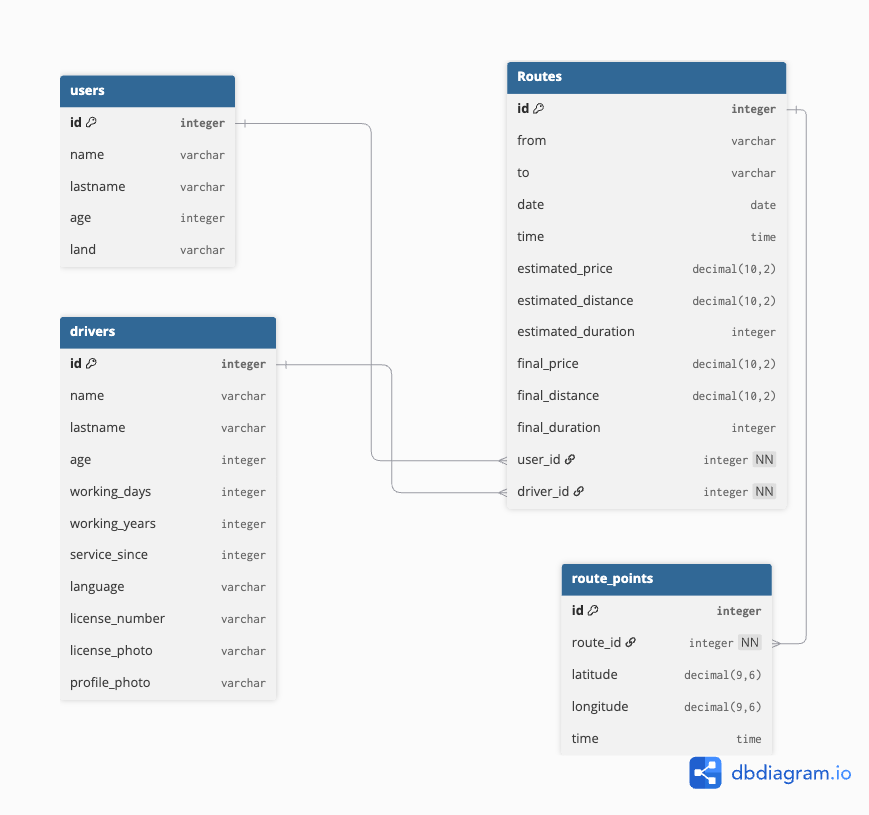
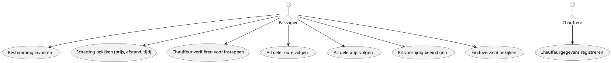
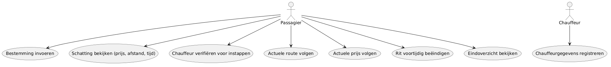

# HitchTracker — Ontwerp (Fase 1)

> Hackathon 3 — B1-K1-W2 (Ontwerpt software)
> Status: in uitvoering

## 1. Probleemomschrijving

Toeristen kunnen in onbekende steden niet goed beoordelen of een taxichauffeur
een eerlijke route en prijs rekent. HitchTracker maakt elke rit transparant:
vooraf een schatting (route, afstand, tijd, prijs), tijdens de rit het actuele
verloop, en na afloop een vastgelegd overzicht waarmee de passagier kan
aantonen wat er echt is gereden en gerekend. De chauffeur wordt vooraf
geverifieerd (document + foto), zodat de passagier weet dat hij bij de juiste
persoon instapt.

## 2. Gegevenslaag — ERD

Tool: dbdiagram.io (DBML)

```dbml
Table users{
  id integer [pk]
  name varchar
  lastname varchar
  age integer
  land varchar
}

Table drivers{
  id integer [pk]
  name varchar
  lastname varchar
  age integer
  working_days integer
  working_years integer
  service_since integer
  language varchar
  license_number varchar
  license_photo varchar
  profile_photo varchar
}

Table Routes{
  id integer [pk]
  from varchar
  to varchar
  date date
  time time
  estimated_price decimal(10, 2)
  estimated_distance decimal(10,2)
  estimated_duration integer
  final_price decimal(10, 2)
  final_distance decimal(10,2)
  final_duration integer
  user_id integer [ref: > users.id, not null]
  driver_id integer [ref: > drivers.id, not null]
}

Table route_points {
  id integer [pk]
  route_id integer [ref: > Routes.id, not null]
  latitude decimal(9,6)
  longitude decimal(9,6)
  time time
}
```


[Bekijk ERD op dbdiagram.io](https://dbdiagram.io/d/Hitchtracker-6aba51070f25a52d01296630)

**Ontwerpkeuzes (kort):**
- `route_points` is een losse tabel (1-op-veel met `Routes`) omdat één rit uit veel GPS-punten bestaat, niet als kolom te proppen.
- `final_price`, `final_distance`, `final_duration` zijn afgeleide waarden: berekend uit `route_points`, maar wel apart opgeslagen in `Routes` i.p.v. telkens herberekend (zie 5.1 Haalbaarheid).
- `license_number`, `license_photo`, `profile_photo` in `drivers` dekken de chauffeurverificatie vóór de rit (Epic 1).

## 3. Gebruikersperspectief

### 3.1 Use case diagram





### 3.2 Use case beschrijvingen
<!-- TODO: per use case — actor, trigger, stappen, alternatieve flows -->

### 3.3 Wireframes / mock-ups
<!-- TODO: belangrijkste schermen -->

## 4. Programmalogica

### 4.1 Activiteitendiagram
<!-- TODO: PlantUML, kernlogica (bijv. rit starten → GPS loggen → rit afsluiten → final-waarden berekenen) -->

## 5. Onderbouwing

### 5.1 Haalbaarheid

`final_price`, `final_distance` en `final_duration` worden berekend uit de punten
in `route_points` (eerste en laatste `time`, en de afgelegde afstand/coördinaten
tussen de punten), maar worden na die berekening apart opgeslagen in `Routes`
in plaats van telkens opnieuw berekend te worden. Reden: zodra er veel ritten
zijn, zou je bij elke opvraging (bijv. klantenservice-overzicht van een hele
maand) door alle route_points van elke rit moeten lopen om de tijd/afstand/prijs
opnieuw te berekenen, dat is trager dan het resultaat één keer te berekenen
en klaar te zetten in `Routes`. De brondata (route_points) blijft bewaard als
bewijs, de final-kolommen zijn het al-berekende antwoord daarop.

### 5.2 Ethiek
<!-- TODO: -->

### 5.3 Privacy
<!-- TODO: locatiedata, chauffeurdocumenten/foto's — wat leg je vast, hoe lang, wie mag het zien -->

### 5.4 Security
<!-- TODO: -->

## 6. Concurrentieanalyse
<!-- TODO: wat doen vergelijkbare apps goed/niet goed -->

## 7. Planning (3 weken)
<!-- TODO: fase 1 / fase 2 / fase 3, per week -->

## 8. Akkoord leidinggevende
<!-- TODO -->